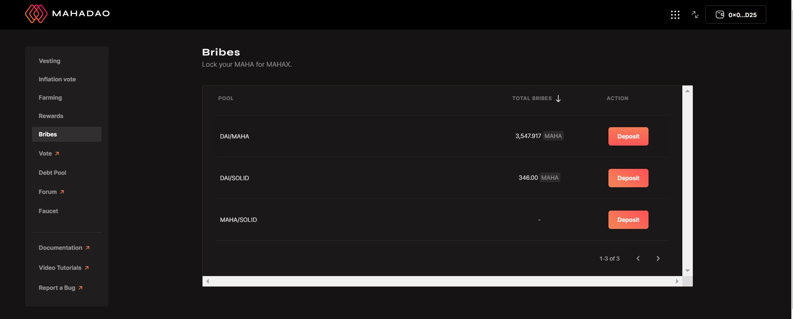

# Bribes

The bribers are trying to influence the voters to make a decision in favor of their Liquidity Pool so that it gets a higher allocation of the rewards. In exchange, the voters are provided with another token.&#x20;

Step 1: You need to visit [https://gov.mahadao.com/](https://gov.mahadao.com/) and navigate to the 'bribes' section on the left.&#x20;

Step 2: You need to have MAHA to deposit into any of the pools.&#x20;

Step 3: Once you have selected the pool you want to make the bribe for you need to click on the deposit button.&#x20;

NOTE: The concept of the bribe works by the user depositing an amount larger than the 'Total Bribe' amount for the pool selected. Suppose for example: The total bribe amount of a pool is 783 MAHA. Then the next user who needs to bribe the voters for that pool needs to invest any amount more than 783 MAHA.&#x20;

Step 4: Once you have clicked on deposit; you need to input an amount more than the total bribe amount and click on deposit.&#x20;

Step 5: Once you click on the deposit and get a confirmation regarding the transaction; then the user has successfully completed the bribe process.&#x20;

