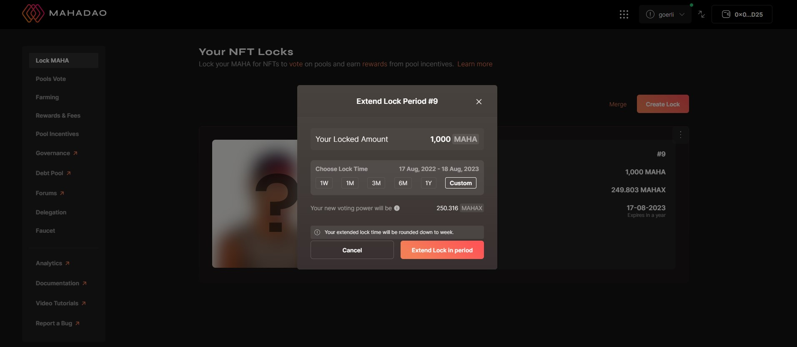

# Extending Lock for Already Locked MAHAX

**Step 1:** Suppose you want to extend the lock period on the MAHAX that you have locked, then you need to click on the **Extend Lock** button.

**Step 2:** Once you click on the request for the **Extend Lock in period** and confirms the same, the new updated date will be shown on the home page.&#x20;

\
_**NOTE**: At any given point in time, the lock period can be extended for a maximum period of four years._
