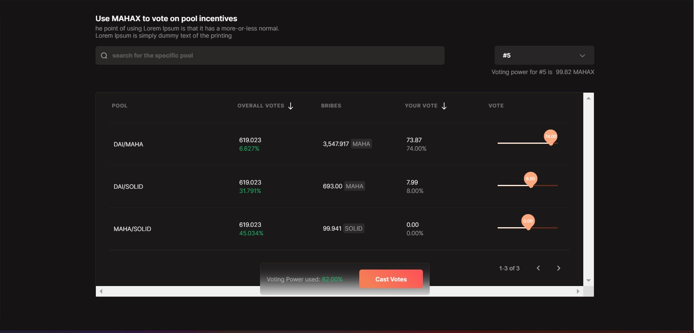

# How to vote for a pool?

Step 1: You need to visit [https://gov.mahadao.com/](https://gov.mahadao.com/) and navigate to the 'Inflation Vote' section on the left.&#x20;

Step 2: You need to have MAHAX NFT's to use it for voting in any of the pools.&#x20;

Step 3: Once you navigate to the 'Inflation vote' section you will see different pools that are displayed along with a scroll bar.&#x20;

.jpg>)

**NOTE:**&#x20;

* The scroll bar will helps you select the percentage amount that you want to use for voting for that specific pool.&#x20;
* You can select the percentage value for multiple pools at the same time.&#x20;
* You can vote any number of times they want.
* You can vote for a specific pool as long as the voting rate is less than 100 percent.&#x20;

Step 4: Once you select a pool; use the scroll bar to select the voting power percentage you want to cast.&#x20;

Step 5: The 'Cast Vote' button will be highlighted for a user only when the voting power is less than 100 percent. If it is anything more than the allowed percentage the user will not be able to vote.

Step 6: To cast the vote you just need to click on 'Cast vote'.&#x20;

Step 7: You will get a confirmation box regarding the pools you have selected along with the voting percentage that you are casting for each pool.&#x20;

Step 8: You need to click on 'Confirm' and that completes the process of casting votes.&#x20;
