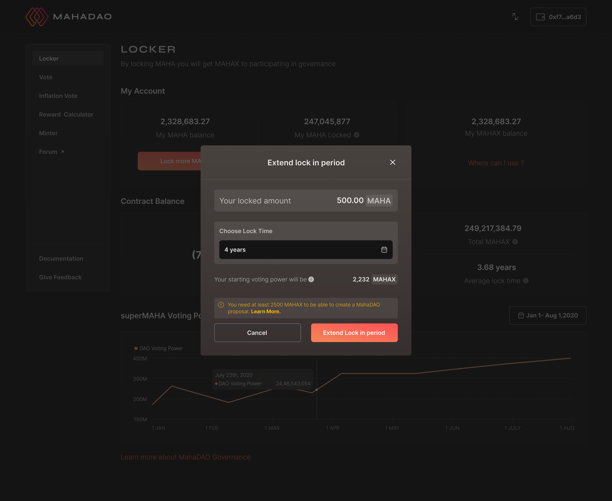

# Staking MAHA for MAHAX

## Staking MAHA for MAHAX

Step 1: Click on the locker tab. After which the user needs to click on lock MAHA. The details about the wallet and the previous MAHA locked if any by the user is displayed.


Step 2: After clicking on lock MAHA the user needs to input the number of MAHA tokens the user wants to lock and also select the time period.  
  
Step 3: Given below is a use case where a user is locking 10 MAHA for a period of 3 months. The user needs to click on "LOCK MAHA" to submit the same.  

Step 4: In case a user wants to select a different time frame they can accordingly make the changes. The time frame can vary from any time between one week to 4 years and also the user can customize the time frame according to their requirements.

Step 6: This final submit will confirm the lock on the number of tokens the user has locked and the changes will be reflected on the following home page.  

## Extending lock for already locked MAHAX

Step 1: Suppose a user wants to extend the lock period on the MAHAX that the user has locked; the user needs to click on the extend lock period button.  

Step 2: Once the user submits the request for the extend lock period and confirms the same; the new updated date will be shown on the home page.   
NOTE: At any given point in time the lock period can be extended for a maximum period of four years.

## Withdrawing MAHAX for MAHA

Step 1: Just lock the token you are awarded with voting power that is MAHAX.

Step 2: Once the lock period is over you can withdraw your locked token, i.e. MAHA.

