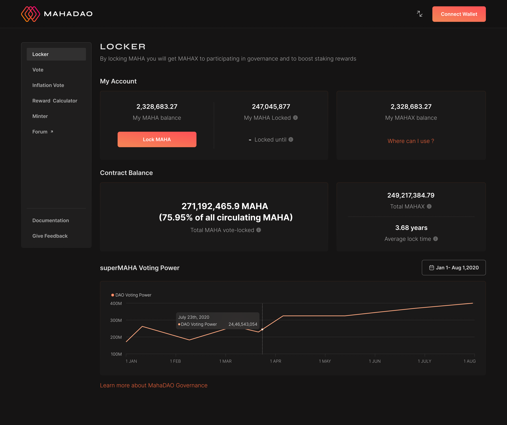
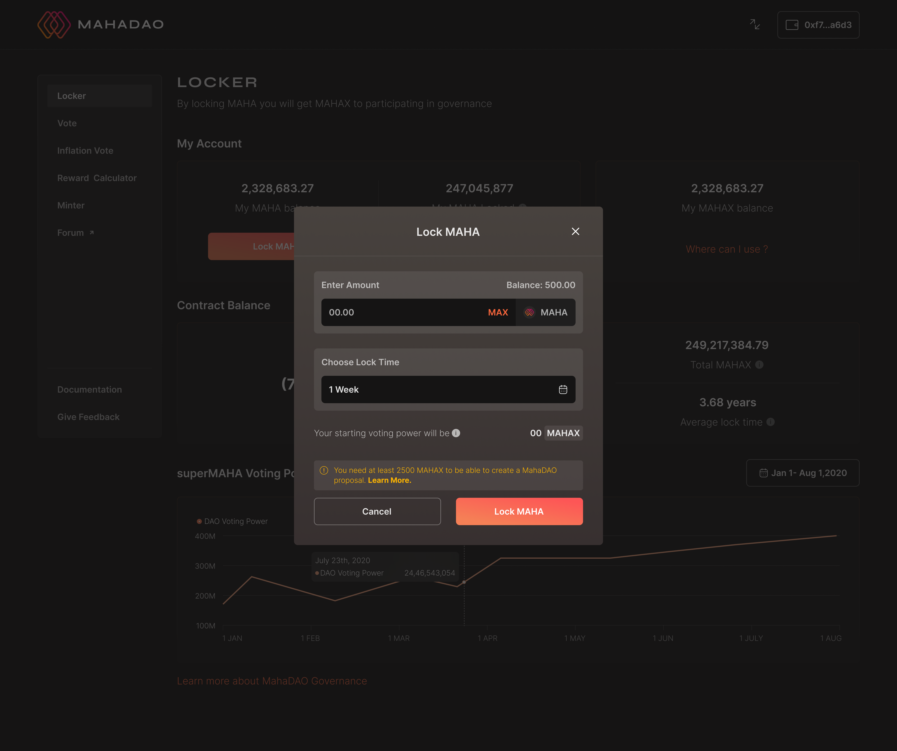
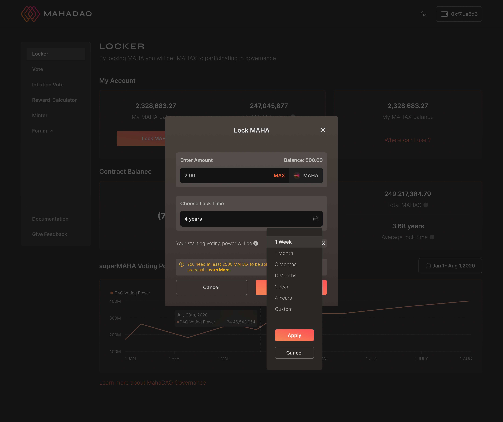
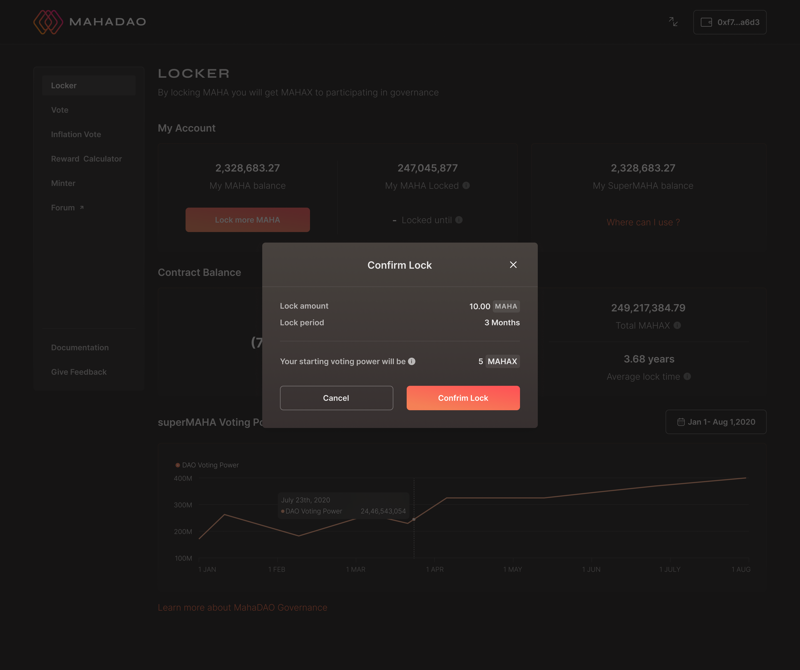
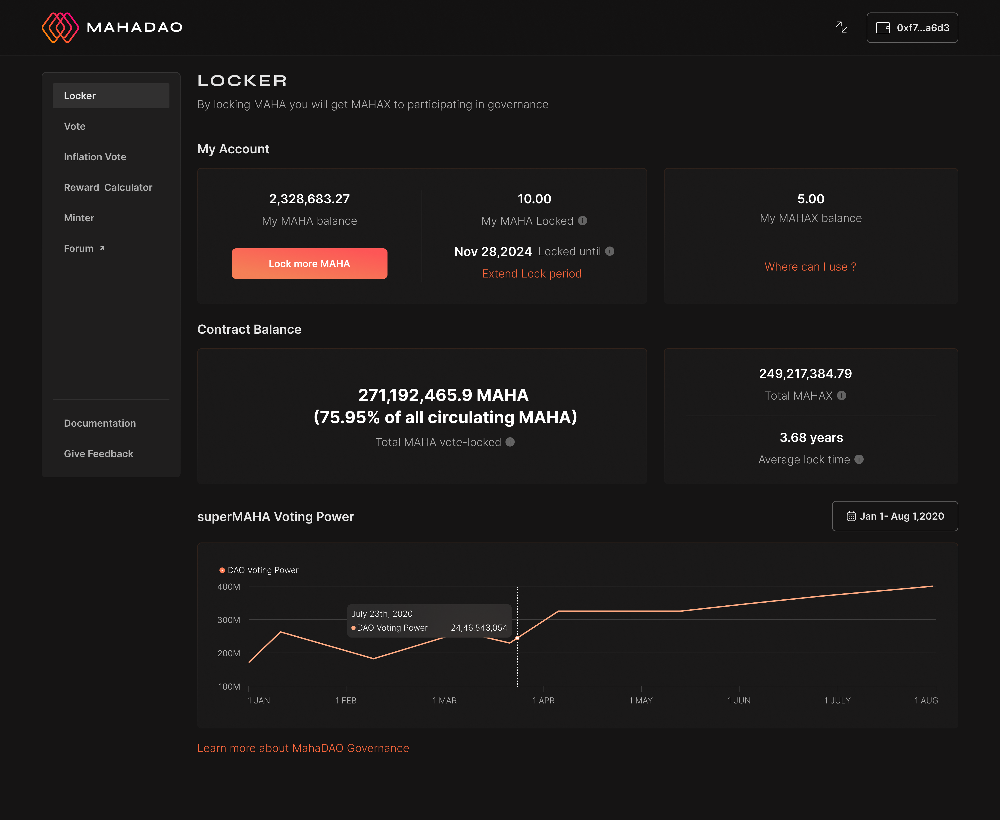

# Staking MAHA for MAHAX

## Staking MAHA for MAHAX

**Step 1:** Click on the locker tab. After which, the user needs to click on **Lock MAHA**. The details about the wallet and the previous `MAHA` locked if any by the user is displayed.


**Step 2:** After clicking on **Lock MAHA** the user needs to input the number of `MAHA` tokens the user wants to lock and also select the time period.\
\
**Step 3:** Below is a use case where a user is locking `10 MAHA` for 3 months. The user needs to click on **Lock K MAHA** to submit the same.

**Step 4:** In case a user wants to select a different time frame, they can accordingly make the changes. The time frame can vary from one week to 4 years, and the user can customize the time frame according to their requirements.

**Step 5:** This final submission will confirm the lock on the number of tokens the user has locked and the changes will be reflected on the following home page.\

