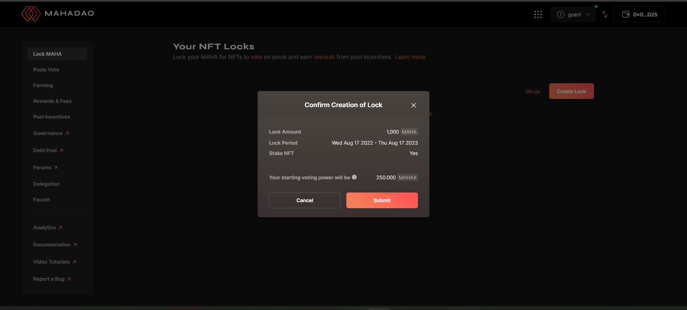
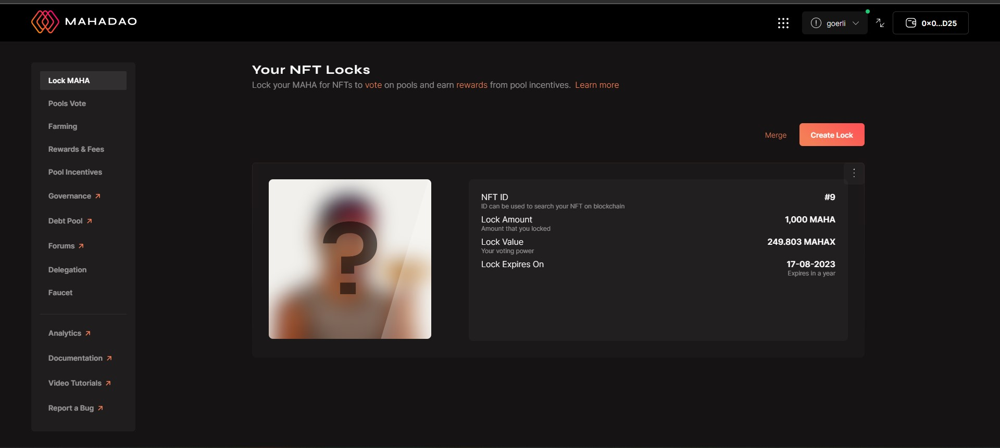

# Locking MAHA for MAHAX

**Step 1:** Go to [https://gov.mahadao.com/#/locker](https://gov.mahadao.com/#/locker) and click on the locker tab. After which, you need to click on **Lock MAHA**. The details about the wallet and the previous `MAHA` locked if any by the you will be displayed.

.jpg>)


**Step 2:** After clicking on **Lock MAHA** you need to input the number of `MAHA` tokens you want to lock and also select the time period.\
\
**Step 3:** Below is an example of a case where suppose you are locking `10 MAHA` for 3 months. After this you need to click on **Lock MAHA** to submit the same.

**Step 4:** In case you want to select a different time frame, you can accordingly make the changes. The time frame can vary from one week to 4 years, and you can customize the time frame according to your requirements.

**Step 5:** This final submission will confirm the lock on the number of tokens you have locked and the changes will be reflected on the following home page.

.jpg>)

