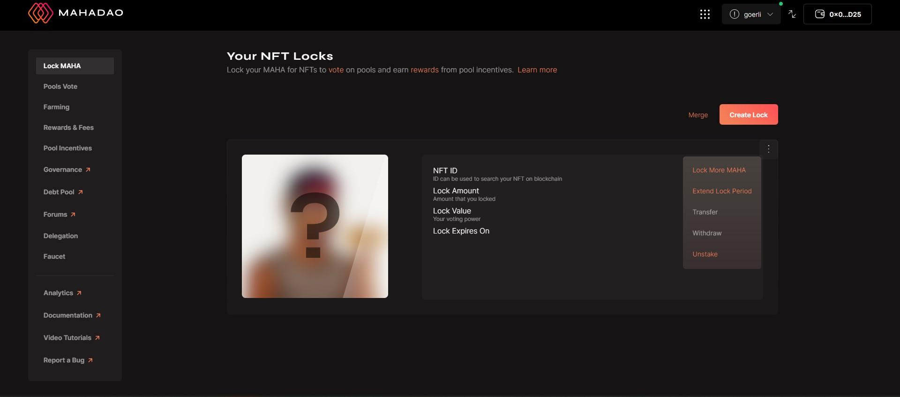

# Unstake NFT

Step 1: Suppose you want to unstake your NFT that you have locked then you need to click on the ellipsis button that you want to carry this operation out on and click on unstake.&#x20;

Step 2: This will be followed by a metamask wallet confirmation regarding the change and once you confirm the transaction you will get an update regarding the successful completion of the transaction.&#x20;

Step 3: Suppose you want to stake this NFT again you can do so by clicking on the stake button for the specific NFT.&#x20;

