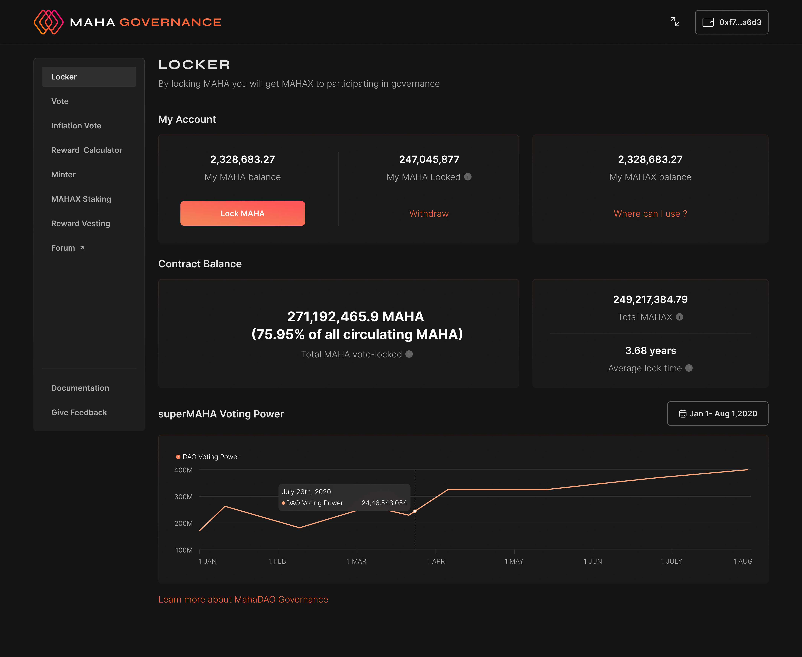

# Withdrawing MAHAX for MAHA

Step 1: Just lock the token you are awarded with voting power that is MAHAX.

Step 2: Once the lock period is over you can withdraw your locked token, i.e. MAHA.

Step 3: You can withdraw your MAHA by clicking on the 'withdraw' button.&#x20;

NOTE: You will get the withdraw option only once the lock period is over.&#x20;

