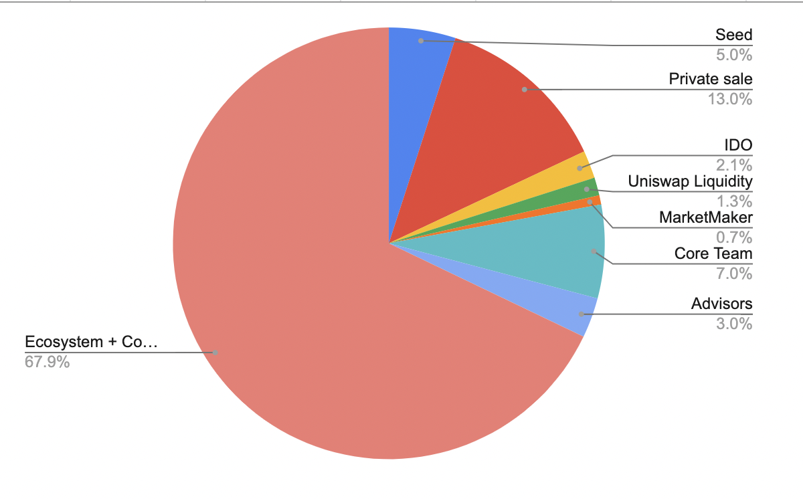

# C.2 - Delegation

### What is Delegation?

In the context of governance, 'Delegation' simply refers to a mutual consent of bestowing one individuals voting power to another - the 'Delegate'. This system can help counter the predominant voting power of whales, who may act in a bias position that is not aligned with the broader community. In addition, Delegation introduces different elements of appeal; Reputation, credibility, expertise -- all of which can help put voting support behind another, irrespective of their personal wealth.&#x20;

### Theory

On the surface, it seems reasonable (if not ideal) to govern through the expertise, reputation and credibility of individuals -- this is what delegation aims to leverage. However, due to unequal access to quality education, resources and associate networks; there is a gross disadvantage that underpins a 'Meritocracy' -- primarily these are socioeconomic factors that impact access and opportunity over accumulated generations. Still, this is more of an ethical matter which none-the-less can still yield efficient and effective governance; albeit room for improvement. \
\
In practical application, not always will the 'wisdom of the crowd' lead to the best outcome, regardless of popularity; this is especially true for proposals that are technical, complex and highly sensitive. In this regard, nuance considerations are generally overlooked or incomprehensible to the layman. The ideal approach is to lean into the relevant expertise, credibility and reputation of delegates. In this way, consensus typically follows in hindsight -- as any conceptual understanding will always be limited.\
\
The traditional beliefs held around plutocracies, don't really apply within the context of on-chain delegation. The reason being, is unlike traditional election cycles and governments; a delegates power may also be revoked at any time. This introduces additional and ongoing accountability on a proposal-by-proposal basis. In a way, on-chain delegation is a form of representative democracy that has a much more responsive adjustment to individual preference. Even so, delegation still remains a more or less a passive involvement for most; one where consensus is generally only evaluated in hindsight.

* Examples of positive outcomes (Which are generally associated with Triage Classification 2).
* Examples of negative outcomes (Which generally have been isolated into other classifications)

### C.2 - Proposal Applications (MIP's)

<mark style="color:blue;">CLASSIFICATION 2 - (C-2) The Proposal may impact any or all of the following;</mark> \ <mark style="color:blue;"></mark>_<mark style="color:blue;">1. Security and Functionality of Protocol/Ecosystem Contracts</mark>_\
_<mark style="color:blue;">2. Partnership and Service integrations to MahaDAO Ecosystem</mark>_\ <mark style="color:blue;"></mark>\ <mark style="color:blue;"></mark><mark style="color:blue;">`C.2 Proposal types may utilize delegation, without requirement of a consensus pass as outlined in the follow chapter; "C.3 - Consensus Hybrid".`</mark>

In this classification, we're primarily focused with the security of the protocol, and the protection of our community. This demands an emphasis on being able to identify not only malicious and overt risks, but also unintended consequences. Ideally, we encourage both technical and strategic specialists to consider delegate nomination.&#x20;

* <mark style="color:blue;">Technical Proposals</mark>\ <mark style="color:blue;"></mark>This refers to proposals that are attached with executable code or contract that will interact with the MahaDAO Protocol and/or ecosystem. \

* <mark style="color:blue;">Partnership and Service integrations</mark>\ <mark style="color:blue;"></mark>As we have witnessed many exploits and hacks around bridges and oracles, we have included this proposal type as high risk and of a technical specialization.&#x20;

### Safety Check

If the DAO fails to protect the protocol from any malicious governance attack, then we have in place a 'Safety Check' that will ensure the protocol and community remains protected and secure. \
\
_**The 'Safety Check' is limited to the prevention of malicious proposals executing; it can not be used for an affirmative purpose to support a proposal.**_ This backup security feature will be operated by anonymous individuals; this is to ensure their protection and privacy, whilst eliminating the opportunity to solicit preferences.

#### <mark style="color:blue;">Grace Period</mark>

Once a submitted proposal has passed vote, it will either observe a 7 or 30 day 'grace period' before executing. It is during this grace period that the proposal will be thoroughly evaluated for any malicious attack. If a threat is deemed present, the 'Safety Check' will be used to Veto the Proposal. In the unlikely event of this occurrence, a full disclosure report will be made available; detailing the prevented threat.   &#x20;

\
