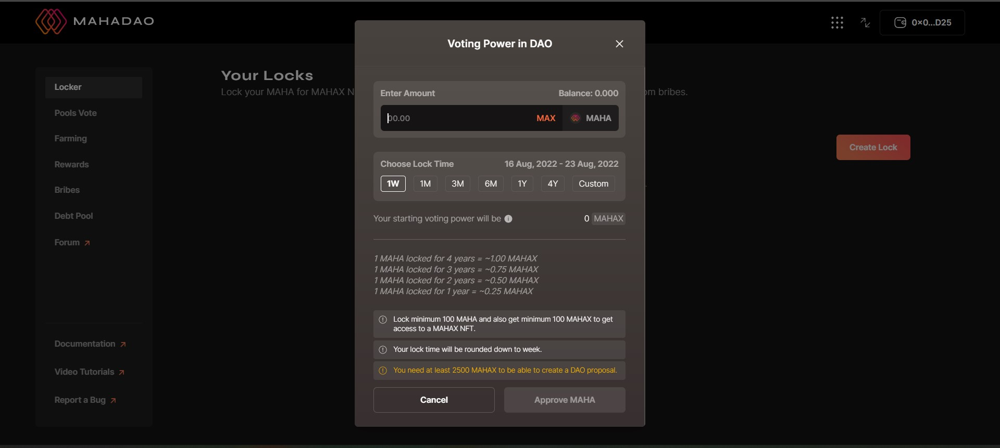

# How to operate a locker?

To start vesting the user must have some MAHA locked in. For this purpose the user needs to create a locker and then lock some MAHA for a certain time period.&#x20;

### CREATE A LOCKER:&#x20;

Step 1: Go to the site and navigate to the locker section on the left.&#x20;

Step 2: A first time user needs to click on 'create a lock'.

Step 3: Once a user clicks on 'create lock'  they need to input an amount of MAHA that they want to lock.

Step 4: After which the user needs to select the time period for which they want to lock the MAHA for. The time frame varies from one week to a maximum period of four years. The users  can also customize the time frame according to their requirements. \
NOTE: The time frame cannot exceed for more than four years.&#x20;

Step 5: After the user has input an amount and select the time frame the user just needs to check the details and then click on 'Approve MAHA'.&#x20;

Step 6: Once you have approved the MAHA to be locked you will get a transaction update regarding the confirmation after which the user needs to click on 'Lock MAHA' to complete the process.&#x20;

Step 7: Once you get a transaction approval regarding the MAHA being locked you have successfully opened a locker.&#x20;


If a user locks more than 2500 MAHA they are eligible to create a DAO proposal. When a user locks MAHA they get a certain amount of voting power that can be later used to vote for proposals.


NOTE: Once a user has created a locker the user will be assigned with an NFT ID for each locker created. All the details regarding the locker is provided with each locker along with two options:&#x20;

* Extend lock period- In the extend lock period the user can extend the lock period according to their requirements but they can extend it only to a maximum period of four years and not more than that.
* Lock more MAHA- The user can add more MAHA to be locked. The more MAHA the user has in the locker the more voting power the user will get.&#x20;
