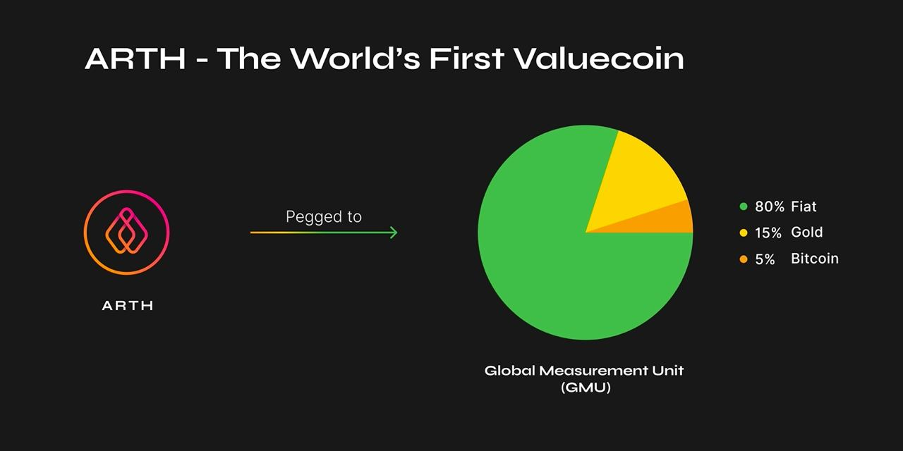

# ARTH Valuecoin

## What is ARTH? 

[ARTH ](https://arthcoin.com/)is a new type of currency designed to not be pegged to government-owned currencies \(like US Dollar, Euro, or Chinese Yuan\), but still remain relatively stable \(unlike Gold and Bitcoin\).

Without being influenced by government-owned currencies, ARTH will be immune to inflation. Through stability, ARTH also becomes a superior choice of currency for means of trade. This is unlike Gold or Bitcoin, which are used more as a store of value rather than a medium of exchange.

## How does ARTH fight inflation but also remain stable?  

ARTH does this by being pegged to a basket of assets that represent strong hedges of each other; so that if one asset depreciates in buying power, the other appreciates because it acts as a hedge against the first asset, keeping the net buying power of the entire basket unchanged.

## Use cases of ARTH

#### No depreciation or loss of purchasing power

One of the biggest differentiators of ARTH amongst other stablecoins is that it is inherently designed to protect a user its purchasing power. This means users who hold ARTH for longer periods of time should see their purchasing power increase when compared to fiat currencies.

#### Taking Leverage loans on ETH & other volatile currencies \(Upcoming\)

With ARTH Loans, the protocol allows users to mint ARTH tokens by placing down some amount of collateral. You can now take out a loan on our [dAPP ](https://polygon.arthcoin.com/)below. 



#### Performing Arbitrage Across Multiple Volatile Currencies

By having trading pairs that offer assets, ARTH in effect also plays the role of becoming an arbitrage token. Allowing traders to trade against the market inefficiencies with ARTH.

Since ARTH will have pairs that include volatile pairs like ARTH/ETH, ARTH/WBTC and ARTH/MAHA and can be redeemed at a common price; the price difference between the two quote assets presents an arbitrage opportunity.

