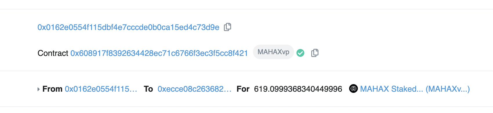

# Distribution & Inflation

The `MAHA` token is a limited supply token with no more than 10 million tokens that will ever be circulated. A vast majority of `MAHA` tokens have been allocated to community and ecosystem-related activities, which underpin MAHA's dedication to being a coin that is governed and controlled by its people.&#x20;

Furthermore, the supply of `MAHA` is stretched out across a period of 10 years to ensure that token holders are as distributed and decentralized as possible. No one entity should be capable of controlling more than 1% of the supply over the course of the next few years.

<figure><figcaption>
Over 67% of the MAHA token's supply is allocated towards community and growth related activities.
</figcaption></figure>

On December 17th, 2020, MahaDAO conducted its very first private sale and IDO, releasing approximately 8% of the supply into circulation.

## A 10-year Distribution Period

The `MAHA` token is unique in the fact that the token is gradually released into circulation over 10 years. This is done to ensure that the `MAHA` token's supply stays as evenly distributed as possible, keeping the entire protocol and the ecosystem secure from whale manipulation.&#x20;

Tokens are released into circulation through a linear distribution to ensure that there is no concentration of tokens amongst early adopters (Except for the first year when private and seed token holders are continuously vested).

_(It is estimated that by the year 3 or 4, the token distribution would be spread out as evenly as possible so that no single entity can control more than 1% of the MAHA supply)._

_Post 10 years, the annual inflation rate drops to 2% per year._

## Month by Month Breakdown

For those who'd like to take precise numbers on how much `MAHA` will get added into the circulation, month by month; an excel sheet (linked [here](https://docs.google.com/spreadsheets/d/1MY3\_\_\_VHDXJc-I4mTNPFQghmVCUo4gONT882QlCSuX4/edit?usp=sharing)) has been created, which goes into depth on how many new tokens get added into circulation.


An interactive excel sheet which showcases token supply month by month

